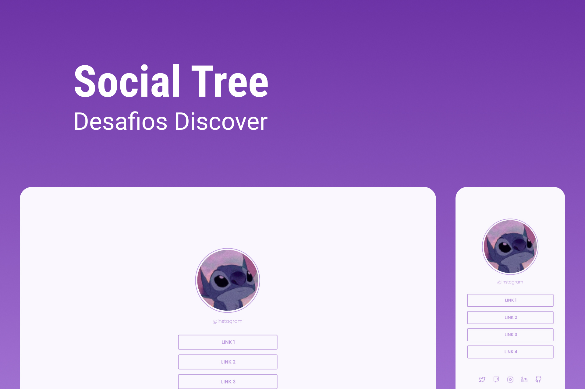

<h1 align="center"> Social Tree </h1>

 

  

## 🚀 Tecnologias

Esse projeto foi desenvolvido com as seguintes tecnologias:

- HTML e CSS
- Git e Github
- Figma

## 💻 Projeto

O SocialTree é  uma página com uma lista de links (menu) que pode ser usada em perfis de redes sociais para direcionar o usuário para o local escolhido.

- [Acesse o projeto finalizado, online](https://LKaua22k.github.io/SocialTree)

## 📝 Licença

Esse projeto está sob a licença MIT.

---

Feito com ♥ by Kauã :wave:
